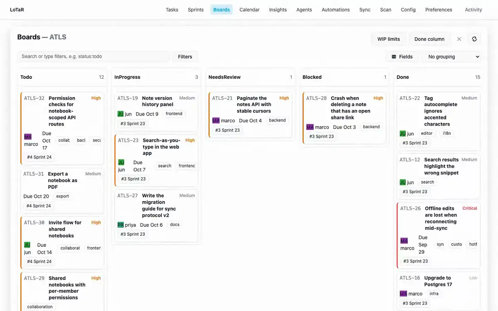
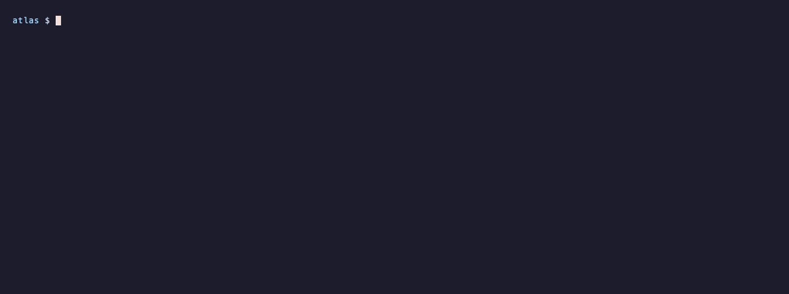
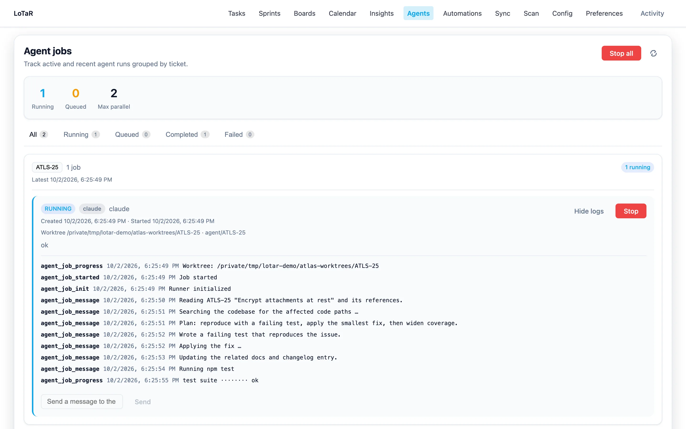
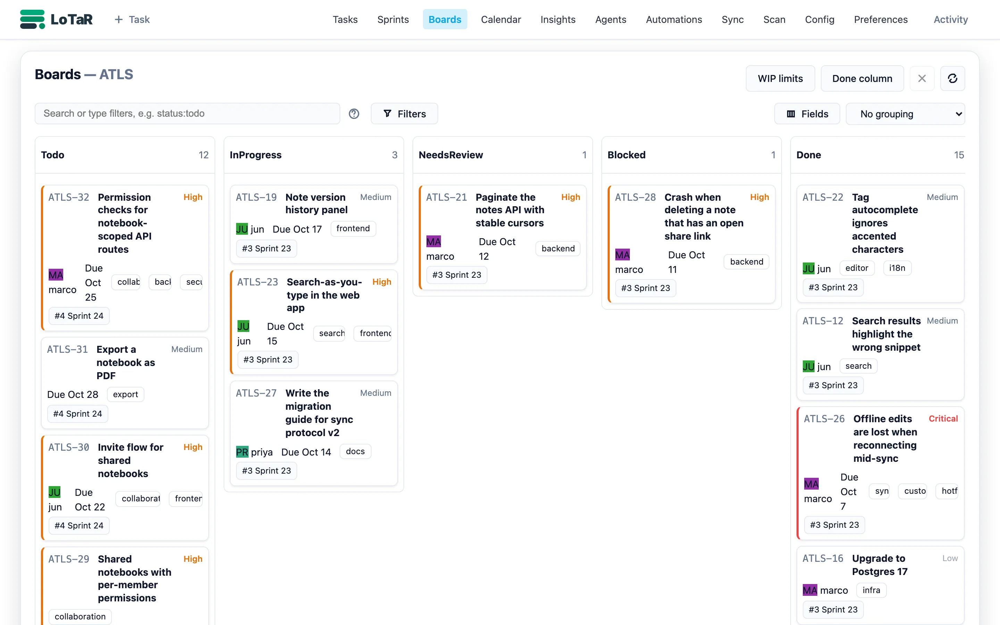
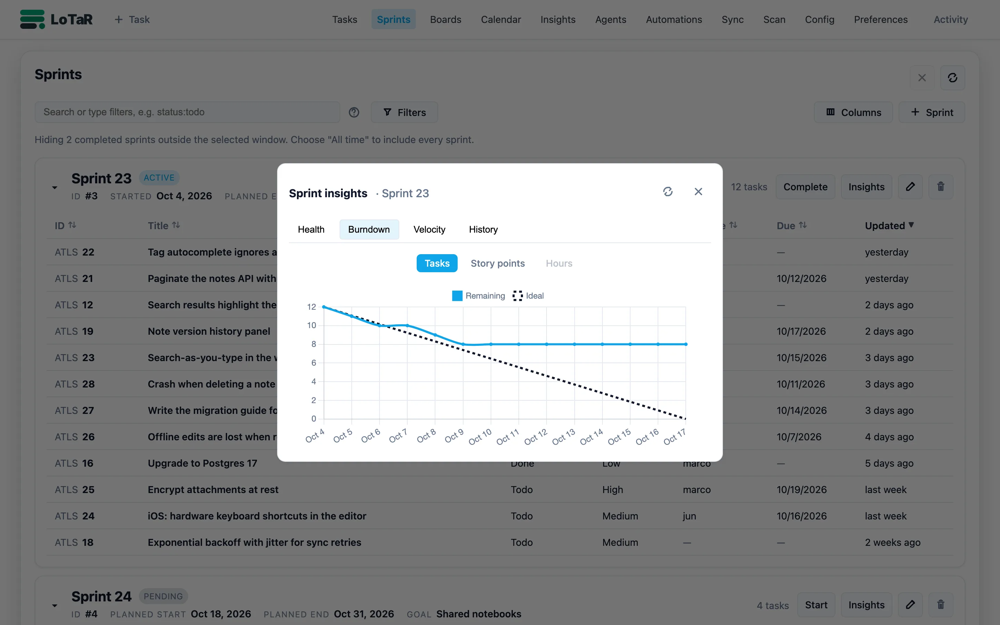
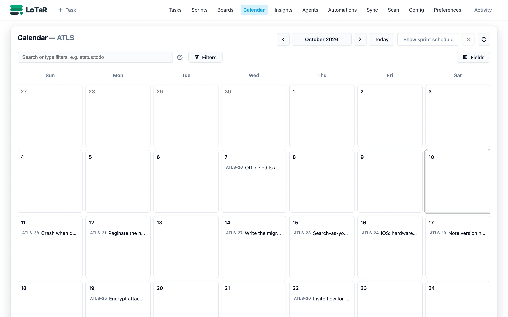
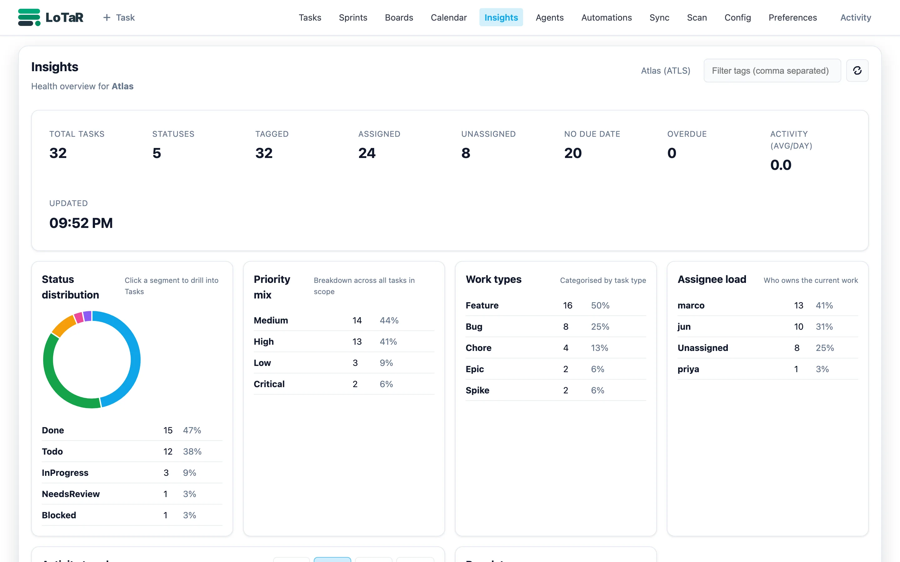
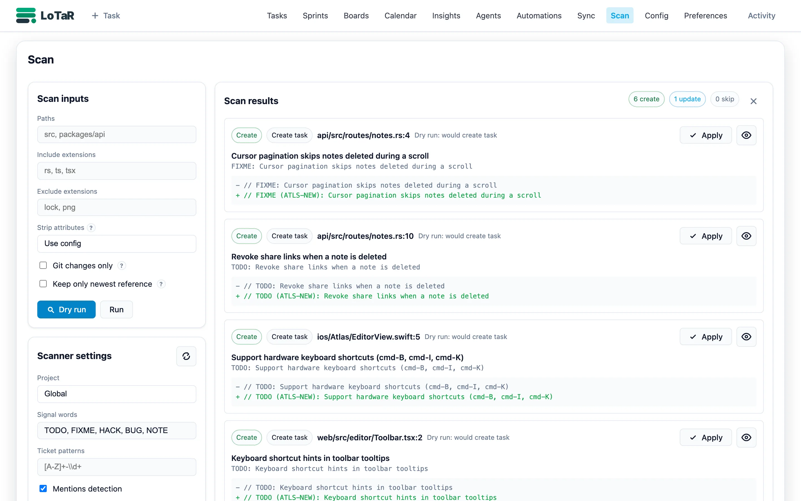
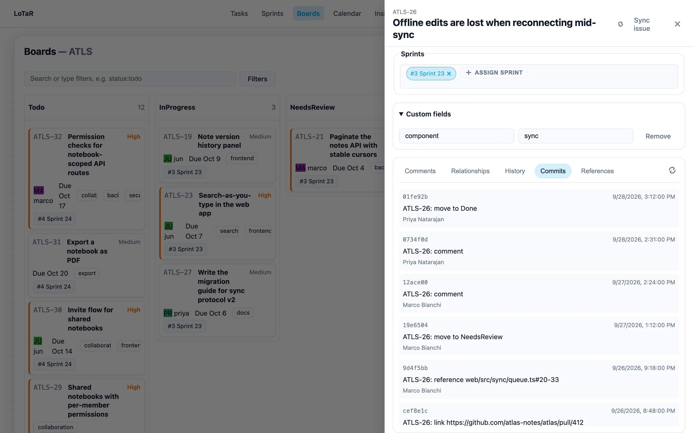

<h1 align="center">
  <picture>
    <source media="(prefers-color-scheme: dark)" srcset="view/assets/branding/lotar-logo-dark.svg">
    
  </picture>
</h1>

<p align="center"><b>A git-native issue tracker that lives in your repo, and can run your coding agents for you.</b></p>

<p align="center">
  <a href="https://github.com/localtaskrepo/lotar/releases/latest"></a>
  <a href="https://github.com/localtaskrepo/lotar/actions/workflows/ci.yml"></a>
  <a href="LICENSE"></a>
  <a href="https://github.com/localtaskrepo/homebrew-lotar"></a>
  <a href="https://hub.docker.com/r/mallox/lotar"></a>
</p>

<p align="center">
  
</p>

LoTaR keeps tasks as plain YAML files in `.tasks/`, versioned and branched with your code. The CLI, the built-in web UI, the REST API, and the MCP server all read and write those same files, so there is no database and no hosted service. Assign a task to an agent profile and LoTaR runs your coding agent CLI on it in an isolated git worktree, streams the log, and hands the task back for review.

## Quick start

| Platform | Install |
| --- | --- |
| macOS | `brew tap localtaskrepo/lotar && brew install lotar` |
| Windows | `scoop bucket add lotar https://github.com/localtaskrepo/scoop-lotar; scoop install lotar` |
| Linux, macOS, Windows | Signed binaries on [GitHub Releases](https://github.com/localtaskrepo/lotar/releases/latest) |
| Any OS with Docker | `docker run --rm -v "$PWD":/workspace -v "$PWD/.tasks":/tasks -w /workspace mallox/lotar list` |

LoTaR is not published on crates.io; to build it yourself, see [Installation](docs/help/install.md#build-from-source).

Then, inside any repository:

```bash
lotar add "Fix the login redirect loop" --type bug --priority high
lotar list
lotar serve --open
```

The first command creates `.tasks/` with sensible defaults. Commit it along with your code.

<p align="center"></p>

## Feature tour

### Agents and automation

Configure an agent profile once, then assign a task to it like you would to a teammate. LoTaR queues a job, runs the agent CLI (Claude Code, Codex, Copilot CLI, or Gemini CLI) in a dedicated worktree on its own branch, and streams the output to the CLI and the web UI. Automation rules in YAML decide what happens on start, success, and failure, and also react to ordinary task changes. See [Agent jobs](docs/help/agent.md) and [Automation rules](docs/help/automation.md).

<picture>
  <source media="(prefers-color-scheme: dark)" srcset="docs/assets/screenshots/agents-dark.webp">
  
</picture>

```yaml
# .tasks/automation.yml
automation:
  rules:
    - name: Agent lifecycle
      when: { assignee: "@agent" }
      on:
        job_started:   { set: { status: InProgress } }
        job_completed: { set: { status: NeedsReview, assignee: "@reporter" } }
        job_failed:    { set: { status: Blocked } }
```

### Web UI: board, sprints, calendar, insights

`lotar serve` starts a local web app on the same files: a filterable task list, a board with WIP limits, sprints with burndown and velocity, a calendar of due dates and sprint windows, and project insights. Changes made in the CLI or by agents show up live. See [Serve](docs/help/serve.md) and [Sprints](docs/help/sprints.md).

<picture>
  <source media="(prefers-color-scheme: dark)" srcset="docs/assets/screenshots/board-dark.webp">
  
</picture>

<table>
  <tr>
    <td><picture><source media="(prefers-color-scheme: dark)" srcset="docs/assets/screenshots/sprints-dark.webp"></picture></td>
    <td><picture><source media="(prefers-color-scheme: dark)" srcset="docs/assets/screenshots/calendar-dark.webp"></picture></td>
    <td><picture><source media="(prefers-color-scheme: dark)" srcset="docs/assets/screenshots/insights-dark.webp"></picture></td>
  </tr>
</table>

### MCP server for coding agents

`lotar mcp` speaks the Model Context Protocol over stdio, so agents in your editor or terminal can list, create, and update tasks, manage sprints, and read config without scraping CLI output. See [MCP server](docs/help/mcp.md) and the [LoTaR agent skill](docs/help/agent-skills.md).

```json
{ "mcpServers": { "lotar": { "command": "lotar", "args": ["mcp"] } } }
```

### TODO scanner

`lotar scan` turns `TODO`, `FIXME`, and similar comments into tasks, writes the new task ID back into the comment, and keeps a code reference on the task that follows the line when code moves. Preview first with `--dry-run`, or pick findings individually on the Scan page. See [Scan](docs/help/scan.md).

<picture>
  <source media="(prefers-color-scheme: dark)" srcset="docs/assets/screenshots/scan-dark.webp">
  
</picture>

### Jira and GitHub sync (beta)

Pull issues from Jira or GitHub into local tasks, or push local changes back, with field and value mappings per remote. Sync runs only when you ask: from the CLI, the Sync page, or MCP. Credentials stay in your home config or environment, never in the repo. See the [sync guide](docs/developers/sync.md).

```yaml
# .tasks/<PROJECT>/config.yml
remotes:
  github:
    provider: github
    repo: your-org/your-repo
    auth_profile: github.default
```

```bash
lotar pull github --dry-run
lotar push github
```

### Git history and stats

Because tasks are files in git, every change has an author and a commit. LoTaR reads that history to show per-task commits and diffs, and to report churn, activity, and authors; these commands only read the repository. See [History](docs/help/history.md) and [Stats](docs/help/stats.md).

<picture>
  <source media="(prefers-color-scheme: dark)" srcset="docs/assets/screenshots/task-commits-dark.webp">
  
</picture>

```bash
lotar task history ATLS-26           # commits that touched the task
lotar stats churn --since 30d        # most-changed tasks
lotar stats authors --since 90d      # who changed tasks
```

### Custom fields and templates

Define your own states, types, priorities, tags, and custom fields per project, or start from the `default`, `agile`, or `kanban` template. Every surface validates against the same config. See [Configuration](docs/help/config.md) and [Templates](docs/help/templates.md).

```bash
lotar init --template=agile --project=mobile
lotar config set custom_fields component,team --project=mobile
lotar add "Offline mode for the editor" --project=mobile --field component=editor
lotar list --where component=editor
```

## How LoTaR compares

An honest snapshot as of October 2026. Rows marked **◀** are where LoTaR is behind at least one alternative.

| | LoTaR | [Backlog.md](https://github.com/MrLesk/Backlog.md) | GitHub Issues | Jira |
| --- | --- | --- | --- | --- |
| Tasks live in your repo | ✅ YAML | ✅ Markdown | ❌ hosted | ❌ hosted |
| Works offline | ✅ | ✅ | ❌ | ❌ |
| Web UI | ✅ local | ✅ local | ✅ | ✅ |
| MCP server | ✅ | ✅ | ✅ official server | ✅ official server (Cloud) |
| Runs coding agents on tasks | ✅ local agent CLIs in worktrees | ❌ | ✅ Copilot coding agent (paid) | ✅ Rovo and third-party agents (Cloud, paid) |
| Automation rules | ✅ | ❌ | ⚠️ via Actions and Projects workflows | ✅ |
| Sprints and burndown | ✅ | ⚠️ milestones, no burndown | ⚠️ iterations, no burndown chart | ✅ |
| Sync with other trackers | ⚠️ Jira and GitHub (beta) | ❌ | n/a | n/a |
| TODO comment scanning | ✅ | ❌ | ❌ | ❌ |
| **◀** Typo-tolerant search | ❌ case- and separator-insensitive only | ✅ fuzzy search | ❌ | ❌ |
| **◀** Docs and decision records | ❌ | ✅ | ⚠️ wiki | ⚠️ via Confluence |

Pick GitHub Issues or Jira when you need a hosted tracker for non-developers, permissions, and integrations. Pick LoTaR when you want tasks reviewed in the same pull request as the code, and agents working those tasks on your own machine.

## How it works

```text
.tasks/
├── config.yml          # workspace defaults: states, types, members, agent profiles
├── automation.yml      # optional automation rules
├── @sprints/1.yml      # sprint plans and actual start/close times
└── ATLS/               # one folder per project
    ├── config.yml      # optional project overrides and sync remotes
    ├── 26.yml          # one file per task
    └── 27.yml
```

```yaml
# .tasks/ATLS/26.yml
title: Offline edits are lost when reconnecting mid-sync
status: Done
priority: Critical
type: Bug
reporter: priya
assignee: marco
due_date: 2026-09-29
effort: 3pt
tags: [sync, customer]
references:
  - link: https://github.com/atlas-notes/atlas/pull/412
  - code: web/src/sync/queue.ts#20-33
history:
  - at: 2026-09-28T15:12:00Z
    actor: priya
    changes: [{ field: status, old: NeedsReview, new: Done }]
```

## Documentation

- [Installation](docs/help/install.md): every install method, Docker usage, building from source
- [CLI tour](docs/help/cli-tour.md): example workflow, multi-project setups, global options, configuration basics
- [Help index](docs/help/index.md): every command and reference page
- [Configuration reference](docs/help/config-reference.md), [precedence](docs/help/precedence.md), and [environment variables](docs/help/environment.md)
- [Agent jobs](docs/help/agent.md), [automation rules](docs/help/automation.md), and the [LoTaR agent skill](docs/help/agent-skills.md)
- [REST API quick reference](docs/help/api-quick-reference.md) and [OpenAPI spec](docs/openapi.json)
- [Architecture decisions](docs/architecture-decisions.md) and [developer docs](docs/developers/README.md)

## Contributing

Bug reports and pull requests are welcome in [issues](https://github.com/localtaskrepo/lotar/issues); report security problems through a [private advisory](https://github.com/localtaskrepo/lotar/security/advisories/new). Development setup, test commands, and conventions are in [AGENTS.md](AGENTS.md) and [docs/developers/](docs/developers/README.md). After UI changes, `npm run screenshots` regenerates every image in this README using an isolated demo workspace.

Full regeneration needs a Git-capable environment. `npm run screenshots -- --no-git` refreshes the non-Git UI screenshots while preserving the existing agent, hero, commit-history and terminal media.

## License

[MIT](LICENSE)
