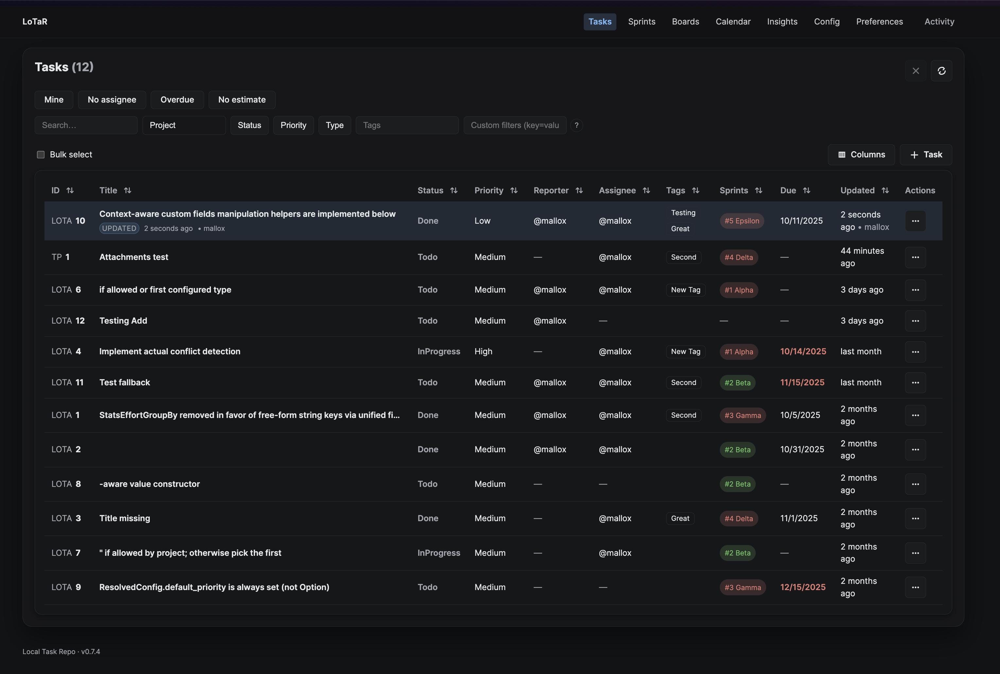
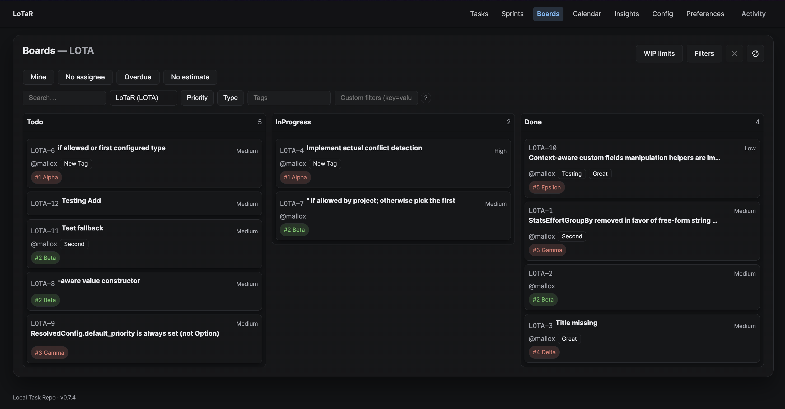
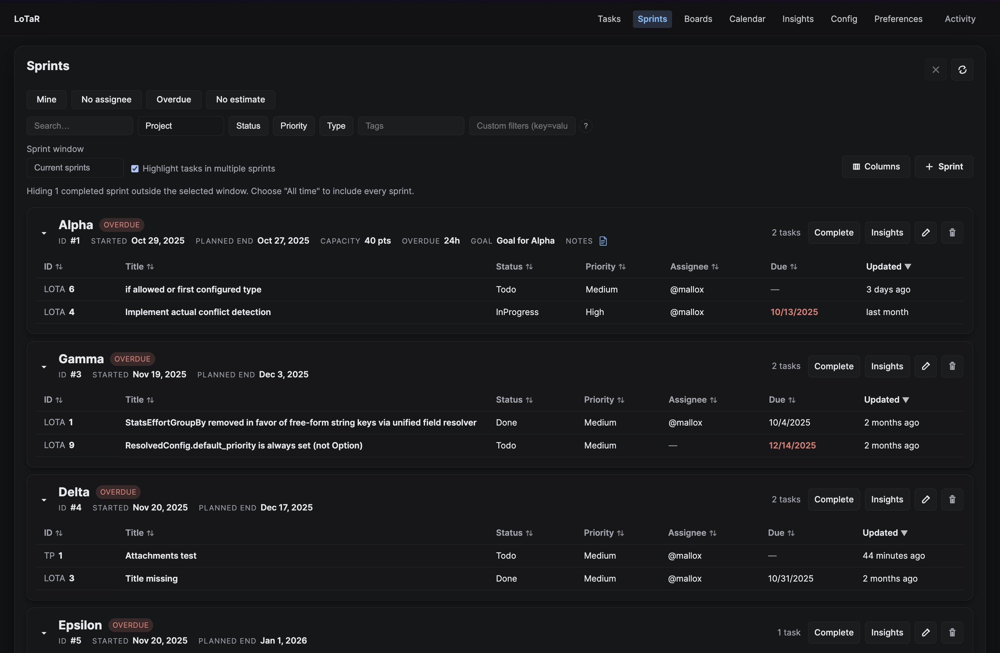
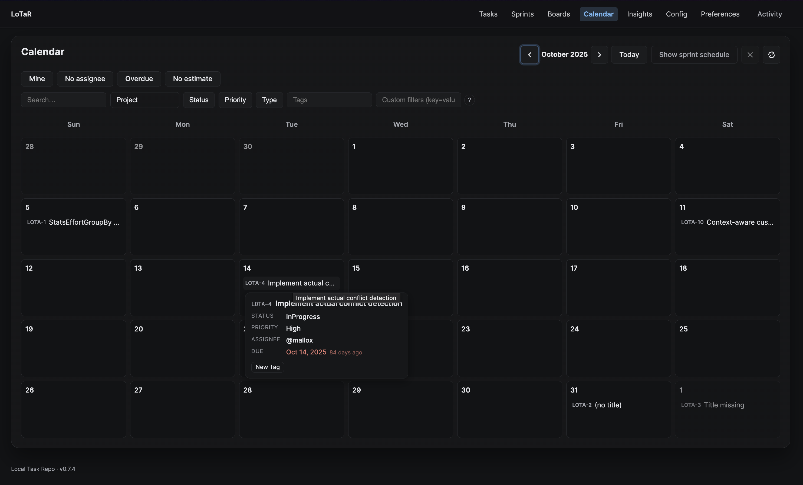
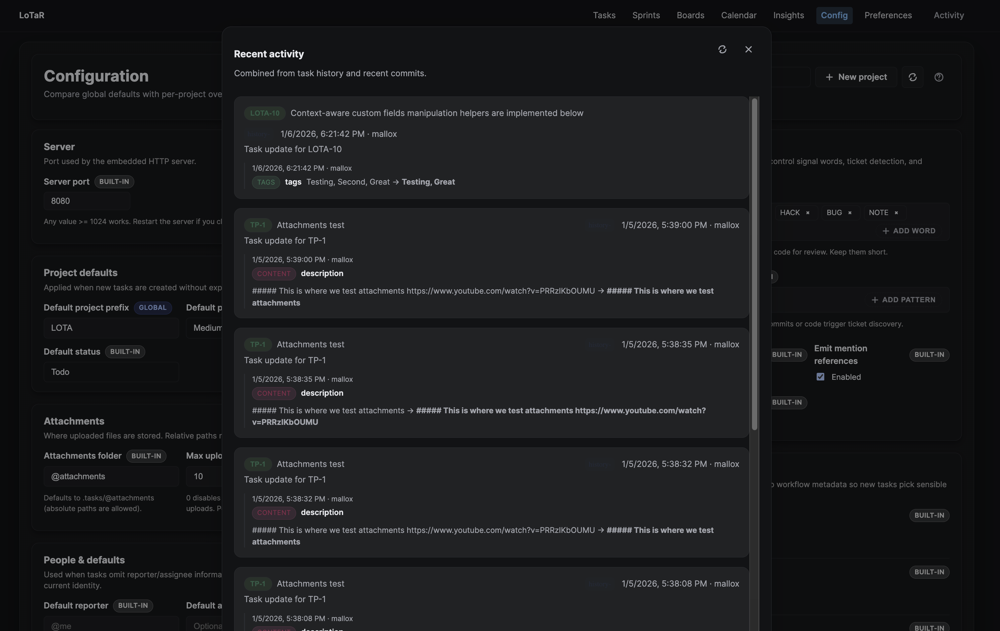

# LoTaR Documentation

## Project Status - November 2025

LoTaR is an actively developed task management tool with a CLI, web server, and source code integration. It includes a comprehensive test suite and aims for stable, predictable behavior.

## Support

- Issues & feature requests: https://github.com/localtaskrepo/lotar/issues
- Security issues: https://github.com/localtaskrepo/lotar/security/advisories/new
- Not sure where to start? See the [Help Index](help/index.md) (especially [Errors](help/errors.md) and [Serve](help/serve.md)).

## Quick Start

### 1. Install the CLI

**Homebrew ([brew.sh](https://brew.sh/), macOS)**
```bash
brew tap localtaskrepo/lotar
brew install lotar
lotar --version
```

**Scoop ([scoop.sh](https://scoop.sh/), Windows)**
```powershell
Set-ExecutionPolicy -ExecutionPolicy RemoteSigned -Scope CurrentUser -Force
iwr -useb get.scoop.sh | iex
scoop bucket add lotar https://github.com/localtaskrepo/scoop-lotar
scoop install lotar
lotar --version
```
Run `scoop install lotar --version vX.Y.Z` if you need to pin a specific release from the
bucket instead of installing the latest manifest.

**GitHub Releases (macOS • Linux • Windows)**
```bash
# Download the asset for your platform from the Releases page
curl -LO https://github.com/localtaskrepo/lotar/releases/latest/download/lotar-vX.Y.Z-linux-musl-x64.tar.gz
curl -LO https://github.com/localtaskrepo/lotar/releases/latest/download/lotar-vX.Y.Z-linux-musl-x64.tar.gz.sha256
sha256sum --check lotar-vX.Y.Z-linux-musl-x64.tar.gz.sha256
tar -xzf lotar-vX.Y.Z-linux-musl-x64.tar.gz
sudo mv lotar /usr/local/bin/
lotar --version
```

**Docker (macOS • Linux • Windows)**
```bash
docker pull mallox/lotar
docker run --rm mallox/lotar --version
```
The image entrypoint is `lotar`, so pass subcommands directly (for example, `mallox/lotar list`).
For a long-running server or Docker Compose examples, see [docs/docker.md](docker.md).
See the [Docker Hub repository](https://hub.docker.com/r/mallox/lotar) for tags and usage
notes.

**Build from source (Rust + Node)**
```bash
git clone https://github.com/localtaskrepo/lotar
cd lotar
npm ci
npm run build:web   # build Vue UI once
cargo build --release
export PATH="$PATH:$(pwd)/target/release"
```

### 2. Point LoTaR at your repo
- Homebrew/source install: run LoTaR commands from inside your repository (`cd path/to/repo`).
- Docker: mount your repo to `/workspace` and your `.tasks` directory to `/tasks`:

```bash
docker run --rm \
    -v "$PWD":/workspace \
    -v "$PWD/.tasks":/tasks \
    -w /workspace \
    mallox/lotar list
```

### 3. Create and track work

```bash
lotar add "Setup project" --project=myapp --priority=HIGH
lotar list --project=myapp --format=table
lotar status 1 in_progress
lotar serve --open  # launches the web UI locally
lotar scan ./src    # optional: capture TODOs
```

> Numeric-only task references work whenever LoTaR auto-detects your single project or you set `lotar config set default_project`. Use fully-qualified IDs (`MYAP-12`) or `--project` when multiple prefixes coexist.

## Release Workflow & Verification

The complete release checklist, automated workflow overview, and manual verification steps
are documented in [`docs/release-guide.md`](release-guide.md). Run through that guide when
cutting a new version or when exercising the Scoop/Homebrew verification workflows.

## Core Features

### Task Management
- **Full CRUD Operations**: Create, read, update, delete via CLI
- **Status System**: TODO, IN_PROGRESS, VERIFY, BLOCKED, DONE
- **Priority Levels**: LOW, MEDIUM, HIGH, CRITICAL
- **Task Types**: Feature, Bug, Epic, Spike, Chore
- **Formatted IDs**: PROJ-1, PROJ-2 format with 4-character prefixes

### Sprint Management
- **Lifecycle Control**: Create, update, start, close, review, and reopen sprints directly from the CLI, REST API, MCP tools, and web UI.
- **Canonical Storage**: Sprint definitions live in `.tasks/@sprints/<number>.yml` with clearly separated `plan` and `actual` sections plus optional history entries.
- **Single Membership**: Tasks own a `sprints: []` field; helpers (`sprint add/move/remove/backlog`) enforce one active sprint per task unless `--force` is used.
- **Integrity & Cleanup**: Commands warn about overdue starts/closes, detect missing sprint files, and clean up dangling memberships with `--cleanup-missing` or `sprint cleanup-refs`.
- **Analytics Suite**: Built-in `sprint summary`, `sprint stats`, `sprint burndown`, `sprint calendar`, and `sprint velocity` surface progress, capacity, and scheduling data in both text and JSON formats.

### Storage & Organization
- **YAML Format**: Human-readable `.yml` files
- **Project Isolation**: Each project gets its own directory
- **Git-friendly**: All files are version-controllable
- **Direct File Operations**: Fast task filtering without indexing overhead
- **Read-only Git Analytics**: Stats derived from repo history (no git writes)

### Source Code Integration
- 25+ languages supported
- TODO comment detection with optional ticket key extraction
- Multiple comment styles: //, #, --, ;, %, /* */ and <!-- -->
- Recursive directory scanning with .lotarignore and .gitignore support
- When creating a task from a TODO, LoTaR writes back the task key into the comment and stores a minimal code anchor under `references` in the task (no code snippets are stored). If a TODO already has a key, LoTaR ensures a code anchor exists and prunes older anchors for the same file, keeping only the latest line for that file. Use `lotar scan --reanchor` to prune cross-file anchors and keep only the newest anchor. On subsequent scans, existing anchors are automatically re-anchored when code moves (nearby-window search) and are updated across simple git renames using `git status` information.

### Web Interface & API
- **Built-in Web Server** with embedded Vue frontend (built via Vite into `target/web`)
- **REST API** for all task operations
    - Multi-value filters for list: `status`, `priority`, `type`, `tags`
    - Proper 404 for unknown resources
    - CORS preflight support for `/api/*`
- **Configurable ports** (default 8080, use `--port` to override; `-p` is reserved for the global `--project` flag)
- **Personalized chrome** — Preferences page lets each user choose system/light/dark themes and an optional custom accent color; browser chrome tint follows the active theme.
- **SSE**: realtime events with `retry` hint and periodic heartbeats
- **Productive task board UI**
    - Saved views persist locally and sync with the current URL so you can return to curated filters quickly.
    - Smart filter chips toggle common slices like Mine, Unassigned, High, In progress, Blocked, Due soon (7d), Overdue, and No estimate without touching the full filter bar.
    - `?` opens an in-app keyboard overlay listing navigation shortcuts (`g t`, `g b`, `g i`, `/` to focus search), with more shortcuts landing soon.

#### Screenshots

| Tasks | Boards |
| --- | --- |
|  |  |
|  |  |

### Server flags and endpoints

- `lotar serve --host 0.0.0.0 --port 8080 --open`
    - `--host` controls the bind address (default: 127.0.0.1). Use `0.0.0.0` to listen on all interfaces.
    - `--open` opens the default browser to the server URL, but does not change bind address.
    - Use `--port <n>` to set the server port. The short `-p` flag is reserved for the global `--project` flag (and `lotar serve` ignores `--project` on purpose).
- Shutdown endpoint: `GET /shutdown` cleanly stops the server. For tests, `/__test/stop` remains available as an alias.

## Command Reference

```bash
# Task Management
lotar add "Title" --type=feature --priority=HIGH
lotar list --project=backend --status=IN_PROGRESS
lotar list --search="keyword" --priority=HIGH
lotar status PROJ-001 DONE
lotar assignee PROJ-001 user@example.com

# System Commands
lotar serve --port 8080   # Start web server
lotar scan ./src          # Scan for TODOs
lotar stats changed --since 14d  # Tickets changed in a window
lotar stats churn --since 30d    # Churn: commits per ticket (sorted)
lotar stats authors --since 90d  # Top authors by commits touching tasks
lotar stats activity --since 60d --group-by day  # Activity by day (author|week|project also)
lotar config set key val  # Configuration

# Task history (read-only)
lotar task history PROJ-1
lotar task diff PROJ-1 --commit <sha>
lotar task at PROJ-1 <sha>
```

## File Structure

```
.tasks/
├── config.yml           # Global configuration
├── PROJECT-A/           # Project directory
│   ├── config.yml       # Project-specific config (optional)
│   ├── 1.yml           # Task files
│   └── 2.yml
└── PROJECT-B/
    ├── config.yml       # Project configuration
    └── 1.yml
```

## Testing & Quality

- **Comprehensive test suite** across all components (see [CI status](https://github.com/localtaskrepo/lotar/actions/workflows/test.yml))
- **Handler Unit Tests**: CLI command handlers
- **CLI Integration**: End-to-end workflows
- **Experimental CLI**: Real command execution
- **Storage Systems**: CRUD operations and validation
- **Configuration**: Config management and templates
- **Project Management**: Smart project resolution
- **Performance Tests**: Operation timing
- **Home Config**: User directory handling
- **And many more**: Comprehensive coverage across all components

**Quality Metrics:**
- Zero compilation warnings
- 100% test pass rate
- Memory-safe with Rust ownership
- Sub-100ms operation performance
- Production-ready code quality

## Development

```bash
cargo build           # Debug build
cargo build --release # Release build
cargo nextest run --all-features # Run all tests (preferred harness)
cargo clippy          # Linting
cargo fmt             # Formatting
```

### UI (local dev)

In one terminal:

```bash
npm run dev
```

This serves the UI on http://localhost:5173 for fast iteration. In another terminal, run the server:

```bash
cargo run -- serve --port 8080
```

Or build UI and run the server that serves embedded static files:

```bash
npm run build
cargo run -- serve --port 8080
```

Ready for production use with no known critical issues.

### Test harness

Install nextest once, then use it directly (or run `npm run test`, which wraps the same command):

```bash
cargo install cargo-nextest --locked
cargo nextest run --all-features
```

Nextest configuration is in `.config/nextest.toml` and sets:
- run-threads = num-cpus
- failure-output = immediate, status-level = fail, fail-fast = true
- a 90s per-test timeout as a guardrail

Need Rust doc tests? Run them explicitly:

```bash
cargo test --doc --all-features
```

## More screenshots

| Calendar | Configuration |
| --- | --- |
|  |  |
